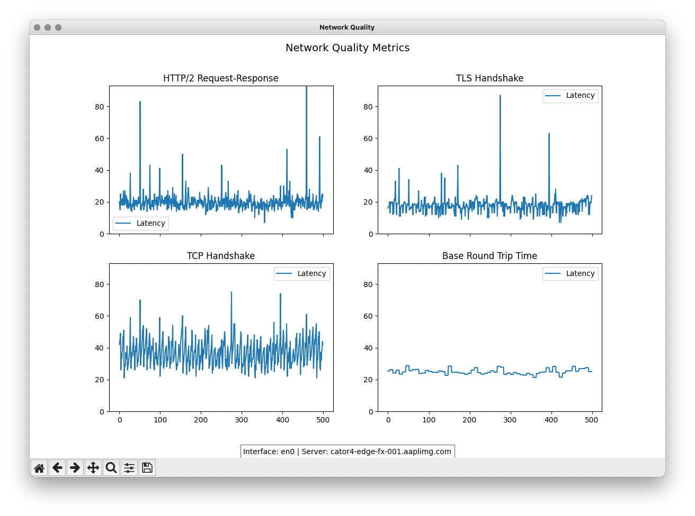
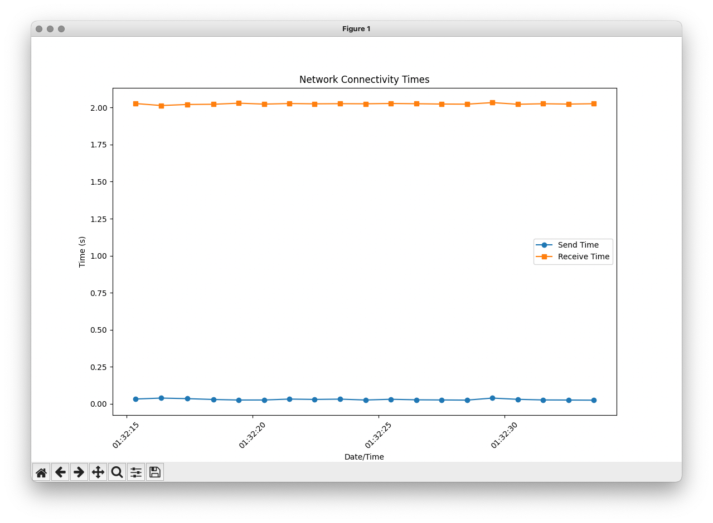
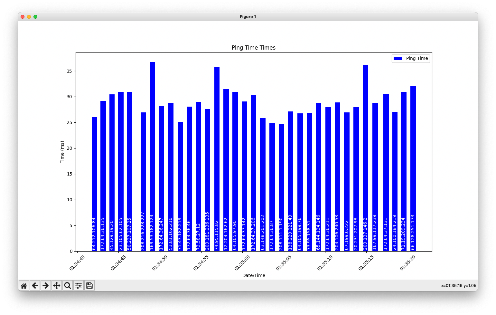

# network tests

Crude monitor for the internet for interruptions

## What?
### network_quality.py, network_test.sh, network_test.py, ping_test.py
A very basic network test that either crawls a website sends a ping, does a dns lookup or establishes a connection, every second.
#### network_quality.py
Based on Apples networkQuality utility, plots the data

Usage:
```bash
usage: network_quality.py [-h] [-d DATA_POINTS] [--log LOG_FILE]

ping_test.py: Continuous network ping test

optional arguments:
  -h, --help            show this help message and exit
  -d DATA_POINTS, --data-points DATA_POINTS
                        how many data points to plot, default 500
  --log LOG_FILE        output log 
```

#### network_test.sh
Based on wget --spider, streams the output of messages

Usage:
``` bash
network_test.sh <site>
```

#### network_test.py
Uses python sock to establish a connection


Usage:
``` bash
usage: network_test.py [-h] [-d DATA_POINTS] [-H HOST PORT TIMEOUT] [--log LOG_FILE]

netwrok_test.py: Continuous network test

optional arguments:
  -h, --help            show this help message and exit
  -d DATA_POINTS, --data-points DATA_POINTS
                        how many data points
  -H HOST PORT TIMEOUT, --host HOST PORT TIMEOUT
                        custom hosts
  --log LOG_FILE        output log
```

#### ping_test.py
Pings servers or makes dns queries


Usage:
``` bash
usage: ping_test.py [-h] [-r REGION] [-R RELIABILITY | -T TOP_DNS] [-d DATA_POINTS] [-t DEFAULT_TIMEOUT] [--filter-long FILTER_LONG] [--filter-failures] [-H HOSTs) [HOST(s ...]] [--dns-lookup | --ping] [--log LOG_FILE]

ping_test.py: Continuous network ping test

optional arguments:
  -h, --help            show this help message and exit
  -r REGION, --region REGION
                        country/region, ex ca, us, ie
  -R RELIABILITY, --reliability RELIABILITY
                        reliability rating of x or higher 0.000-1.000
  -T TOP_DNS, --top TOP_DNS
                        top x for reliability
  -d DATA_POINTS, --data-points DATA_POINTS
                        how many data points to plot
  -t DEFAULT_TIMEOUT, --timeout DEFAULT_TIMEOUT
                        timeout length, default: 0.95
  --filter-long FILTER_LONG
                        don't reuse servers with pings greater than x
  --filter-failures     don't reuse servers that failed
  -H HOST(s) [HOST(s) ...], --host HOST(s) [HOST(s) ...]
                        custom hosts
  --dns-lookup          dns lookup, for the test
  --ping                ping, for the test
  --log LOG_FILE        output log
```


## Why?
I was having some issues ona computer and didn't know if it was network related or computer related\
So I crudely wrote these test to see if I could see the brief packet drops or a computer next to it
And why not publish it, if someone wants a crude test or clean it up and use it

FYI, it was the computer, I think...

## Improvements?
Everything.  This was put together fast and could use lots of cleanup and improvement

## State?
Some bugs, but it served the purpose.  It runs but there is no attempt to filter issues.  

## New
### 1.0
- dns lookups
- icmp pings
- socket connections
- wget site crawler
